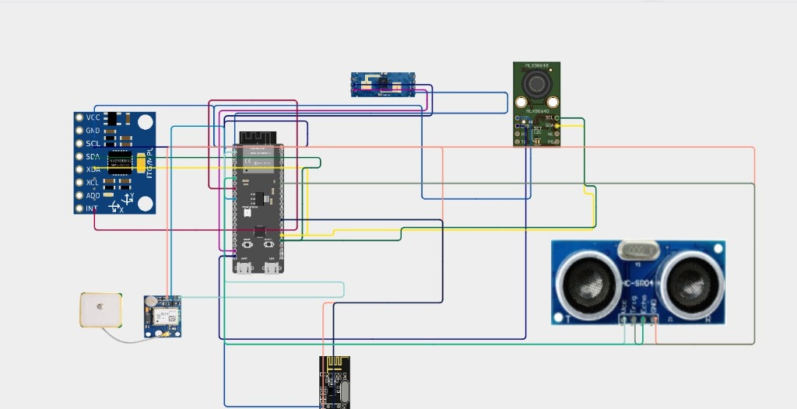

# 137131_SHADOW_VAULT

Description of problem statement :
Low visibility in open-cast mines creates several challenges:
Difficulty detecting vehicles and obstacles ahead.Increased collision and accident risk.Reduced dumper speed and productivity.Increased haul-cycle time.Difficulty monitoring vehicles from the control room.Limited effectiveness of conventional visibility aids.  Difficulty detecting vehicles around blind curves and obstructed areas.  

Proposed solution :
The proposed system works as a multi-sensor driver-assistance and fleet-monitoring platform. Main functions: 1. AI/ML-based analytics – analyzes sensor data and identifies safety risks. 2. Computer vision and thermal imaging – detects vehicles, people, and obstacles.3. Radar-based detection – measures the presence and movement of nearby objects.4. GPS-based tracking – continuously monitors dumper location and movement.5. V2V/V2I communication – allows vehicles and roadside infrastructure to exchange safety information.6. Driver-assistance system – provides visual and audio warnings 7. IoT monitoring – sends vehicle and sensor data to the control room.8. Centralized command system – provides real-time fleet monitoring and alerts.   

## Hardware Schematic

## Project Simulation Video

<video src="https://github.com/chinmayeekashikarec25/137131_SHADOW_VAULT/raw/main/sih_final_video.mp4" controls="controls" style="max-width: 100%;"></video>

